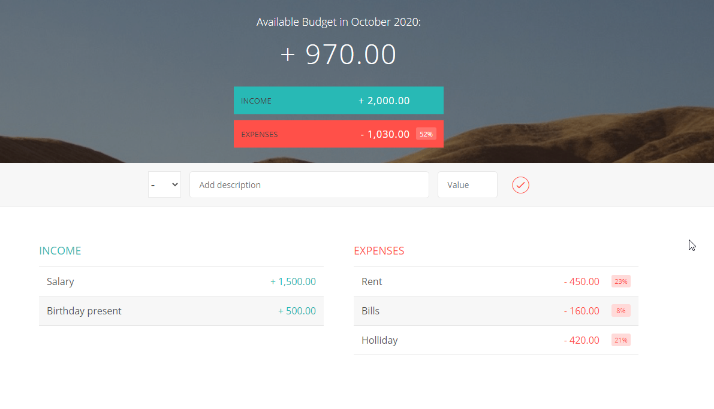

# Budgety App 

A simple application for tracking available budget.

Incomes and Expenses are entered by the user in the input field, then they are displayed in two different columns.

The total amount is displayed with a nice formatting on top of the app.

The user can easily delete any of the records and this immediately affects the calculations.

This app gives the user an opportunity to analyze their costs through a percentage calculations.

It also has the ability to persist data between openings using localStorage.